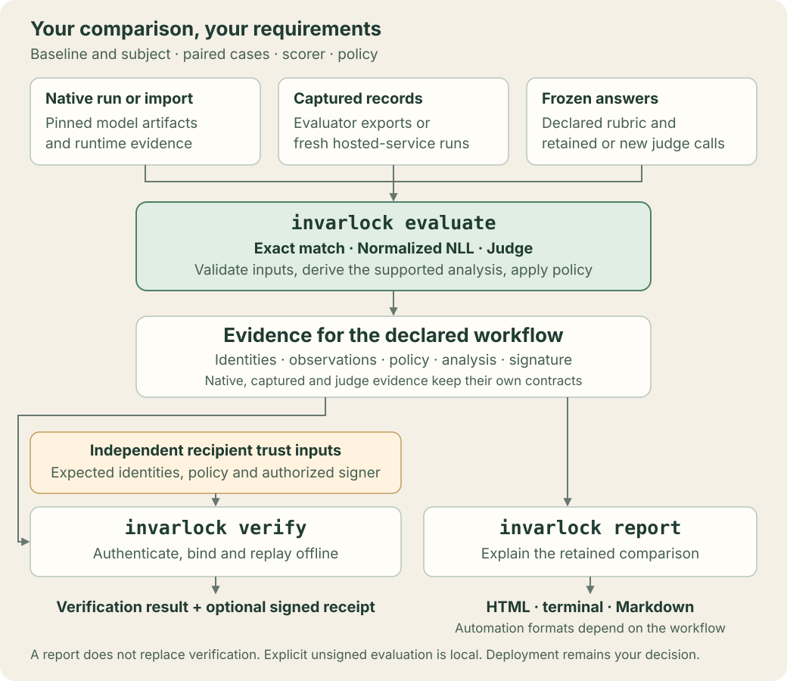

<p align="center">
  <picture>
    <source
      media="(prefers-color-scheme: dark)"
      srcset="https://raw.githubusercontent.com/invarlock/invarlock/main/docs/assets/invarlock-logo-dark.svg"
    />
    
  </picture>
</p>

<p align="center"><em>Evaluate edited checkpoints. Verify regression evidence. Share review-ready reports.</em></p>

<p align="center">
  <a href="https://github.com/invarlock/invarlock/actions/workflows/ci.yml"></a>
  <a href="https://pypi.org/project/invarlock/"></a>
  <a href="https://invarlock.github.io/invarlock/0.12.1/"></a>
  <a href="LICENSE"></a>
  <a href="https://www.python.org/downloads/release/python-3120/"></a>
</p>

InvarLock is a standalone verification layer for transformed open-weight model
checkpoints. It compares a **subject checkpoint** with a fixed **baseline
checkpoint** on paired evaluation records, applies regression and guard
policies, and emits machine-checkable JSON plus human-readable reports.

Typical subjects come from quantization, pruning, adapter merge, fine-tuning,
or another model-edit pipeline. InvarLock fits at the review boundary: bring an
edited checkpoint, evaluate it against its baseline, verify the resulting
evidence, and render the outcome for people and CI.

## How It Works

<p align="center">
  
</p>

`evaluate` creates the paired comparison and guard evidence. `verify`
recomputes the acceptance decision with independently supplied inputs. `report
html` turns the canonical JSON into a review-friendly document.

For a deployed GGUF or TensorRT-LLM artifact, the first-party experimental
runtime-provider workflow authenticates the native artifact, produces one side
per role, and replays a policy-scoped `exact_match` comparison. See [Native
Runtime Providers](docs/user-guide/native-runtime-providers.md) for the
runnable operator path and its bounded claim.

## One Checkpoint Comparison

Install the Hugging Face evaluation surface:

```bash
pip install "invarlock[hf]"
```

The default strict path delegates model loading to an OCI container. Install
and start Docker or Podman, confirm that your account can use it, then inspect
the Python/model environment:

```bash
# Use the equivalent `podman info` when Podman is your selected engine.
docker info
invarlock doctor --json
```

Point the subject at the checkpoint produced by your edit pipeline:

```bash
BASELINE_CHECKPOINT=/path/to/original-checkpoint
EDITED_SUBJECT_CHECKPOINT=/path/to/checkpoint-produced-by-your-edit-pipeline

INVARLOCK_DEDUP_TEXTS=1 invarlock evaluate --allow-network \
  --baseline "$BASELINE_CHECKPOINT" \
  --subject "$EDITED_SUBJECT_CHECKPOINT" \
  --baseline-adapter auto \
  --subject-adapter auto \
  --profile ci \
  --assurance strict \
  --verbose \
  --report-out reports/eval
```

`evaluate` uses the runtime container by default and writes
`evaluation.report.json` plus `runtime.manifest.json`. With `--verbose`, it
prints `Baseline report: ...`; the same retained raw path is recorded as
`provenance.baseline.report_path` in the evaluation report.

The evaluation command displays `Status: PASS` when its report-local policy
gates pass. A generated strict report records
`assurance.verdict=pending_verifier`,
`assurance.report_local_verdict=pass`, and
`assurance.verified_assurance_verdict=pending`. The separate verifier completes
strict acceptance with independently supplied inputs and an exit code of `0`.

### What “strict” means here

A strict verifier pass requires all of the following:

- an evaluation report produced under the strict CI or release contract;
- the complete retained raw baseline `report.json`, supplied to the verifier;
- an independently maintained acceptance policy pack that defines the thresholds;
- an expected runtime-image digest supplied independently of the report;
- valid schema, pairing, metric recomputation, required guard evidence, and
  report/runtime-manifest binding.

Strict evaluation also binds both model inputs to immutable identities. Pass
`--baseline-revision` and `--subject-revision` as full 40–64 character
lowercase hexadecimal commits for remote model IDs. Local checkpoint
directories are bound automatically to deterministic content-tree SHA-256
identities; symlinked or empty checkpoint trees are rejected.
Strict local binding reads the full checkpoint during planning and again before
and after loading; use immutable remote revisions when that additional local I/O
is undesirable.

The verifier caller supplies the acceptance policy pack and expected runtime
digest through a channel independent of the submitted report. This keeps the
acceptance decision anchored outside that report. See [Policy-pack
build and verification](docs/reference/contracts.md#policy-packs) and the
[runtime provenance guide](docs/security/runtime-provenance-guide.md).

Verify with independent acceptance inputs:

```bash
BASELINE_RUN_REPORT=/path/to/baseline/run/report.json
ACCEPTANCE_POLICY_PACK=/path/to/acceptance/policy-pack.json
EXPECTED_RUNTIME_IMAGE_DIGEST=sha256:REPLACE_WITH_REVIEWED_64_HEX_DIGEST

invarlock verify \
  --profile ci \
  --assurance strict \
  --baseline "$BASELINE_RUN_REPORT" \
  --policy-pack "$ACCEPTANCE_POLICY_PACK" \
  --expected-runtime-image-digest "$EXPECTED_RUNTIME_IMAGE_DIGEST" \
  --json \
  reports/eval/evaluation.report.json \
  > reports/eval/invarlock-verify.json

invarlock report html \
  --input reports/eval/evaluation.report.json \
  --output reports/eval/evaluation.html
```

## Inputs and Results

| Surface | Role |
| --- | --- |
| Baseline checkpoint | Fixed reference model. |
| Subject checkpoint | Externally transformed model under review. |
| Evaluation configuration | Dataset, pairing, metric, tier, and guard plan. |
| Raw baseline report | Retained replay input for strict metric verification. |
| Acceptance policy pack | Independently maintained thresholds and policy identity. |
| Expected image digest | Independent match for the manifest’s image claim. |
| `evaluation.report.json` | Canonical comparison and guard evidence; a generated strict report remains `pending_verifier`. |
| `runtime.manifest.json` | Declared runtime metadata bound to the report. |
| `invarlock-verify.json` | Strict verifier outcome and unsigned verification receipt; exit `0` is the acceptance signal. |
| `evaluation.html` | Human-readable rendering; JSON remains canonical. |

A report-local `PASS` records the evaluation-time policy result. A strict verifier
exit `0` records that the supplied report, raw baseline, authorized policy, and
expected image digest satisfied the strict verification contract. The decision
is scoped to the named baseline, subject, dataset, pairing plan, and policy. See
[Reading a report](docs/user-guide/reading-report.md).

## Evidence Maturity

| Surface | Empirical maturity | Current strict behavior | Interpretation |
| --- | --- | --- | --- |
| Paired primary metric | **Implemented, recomputed gate** | Must satisfy the configured paired regression policy. | Main baseline-versus-subject regression decision; field sensitivity depends on the selected data, metric, and thresholds. |
| Invariants | **Stable blocking guard** | Structural and non-finite findings block. | Fail-closed integrity evidence. |
| Spectral | **Operational diagnostic** | Complete findings block under `enforce` and remain visible under `observe`. | Interpret the baseline-relative weight signal only within its calibrated scope. |
| RMT | **Experimental diagnostic** | Complete epsilon findings block under `enforce` and remain visible under `observe`. | Activation edge-risk evidence within the configured workload. |
| Variance/VE | **Experimental intervention** | The predictive gate must be evaluated; a complete failing predictive-gate outcome blocks under `enforce` and remains visible under `observe`. | Workload-specific A/B remediation evidence. |

These labels communicate the maturity of each evidence surface. CI and release
policies can require the corresponding report fields and gate outcomes. See the
[guards reference](docs/reference/guards.md).

## CI Gate

This job fragment checks out and installs the current source before invoking
its repo-local composite action. The action verifies an existing report,
renders HTML, exports review artifacts, and uploads the result:

```yaml
steps:
  - uses: actions/checkout@v4
  - uses: actions/setup-python@v5
    with:
      python-version: "3.12"
  - run: python -m pip install .
  - uses: ./.github/actions/invarlock-report-gate
    with:
      report: reports/eval/evaluation.report.json
      baseline: runs/baseline/report.json
      policy-pack: policy/acceptance-policy-pack.json
      profile: ci
      assurance: strict
      expected-runtime-image-digest: ${{ secrets.INVARLOCK_RUNTIME_IMAGE_DIGEST }}
```

Its exit status is suitable for a required CI check. For released tags, inspect
that tag's action inputs before reusing the workflow.

## Where InvarLock Fits

Use InvarLock when a checkpoint transformation needs a paired behavioral gate,
internal checkpoint diagnostics, and a portable verifier-bound report. It
complements established tools across the broader model lifecycle:

- **NeMo Evaluator** or ordinary CI policy for multi-benchmark release gating;
- **MLflow** for experiment tracking, registry workflows, and metric storage;
- **lm-evaluation-harness** or another evaluator for broad benchmark coverage;
- **Sigstore/SLSA-aligned controls** for artifact authenticity and provenance;
- deployment-specific tools for runtime accuracy debugging and production
  monitoring.

See [Alternatives Comparison](docs/reference/alternatives-comparison.md) for a
workflow-oriented comparison.

## Install and Learn More

```bash
# Lightweight verification and reporting
pip install invarlock

# Model-loading evaluation workflows
pip install "invarlock[hf]"

# Optional guard intervention probes
pip install "invarlock[probes]"
```

- [Getting Started](docs/user-guide/getting-started.md)
- [Quickstart](docs/user-guide/quickstart.md)
- [Compare & Evaluate (BYOE)](docs/user-guide/compare-and-evaluate.md)
- [CLI Reference](docs/reference/cli.md)
- [Runtime Providers](docs/reference/runtime-providers.md)
- [Evidence Packs](docs/user-guide/evidence-packs.md)
- [Trust Model](docs/assurance/14-trust-model.md)
- [Assurance Case](docs/assurance/00-assurance-case.md)

[Evidence Catalog](docs/user-guide/public-evidence-walkthrough.md) tracks which
maintained lanes have current evidence artifacts. Source tags and wheels carry
the compact hash-bound index; the full evidence tree is distributed as the
GitHub Release asset named in that index. All 39 catalog lanes are `noop`
same-checkpoint baseline/subject runs that exercise compatibility and evidence
mechanics; 31 have strictly verified evidence and 8 are **Evidence not yet
created**. Transformation detection and guard effectiveness require an actual
edited subject and are separate from these catalog results. The 31 available
packs use the frozen v1 claim set and remain accepted by the current verifier's
compatibility path; they do not exercise v2 guard authority.

## Project

InvarLock is pre-1.0. Versioned evidence-artifact contracts are intended to
remain stable within their declared versions; non-contract APIs may change in
minor releases. Linux is the primary target, macOS is supported, and Windows
users should use WSL2 or a Linux container.

First-touch help: `invarlock --help`, `invarlock --version`,
`invarlock report --help`, and `invarlock advanced --help`. Use
`invarlock advanced runtime-verify` for the narrower report/manifest
binding check, while `invarlock verify` performs the complete acceptance check.

Machine-readable discovery through `invarlock doctor --json` and
`invarlock advanced plugins ... --json` includes
`model_classification`, `validation_keys`, `console_labels`, and `metric_kinds`;
see the
[contract catalog](docs/reference/contracts.md#contract-files).

- Questions: [GitHub Discussions](https://github.com/invarlock/invarlock/discussions)
- Bugs: [GitHub Issues](https://github.com/invarlock/invarlock/issues)
- Contributing: [CONTRIBUTING.md](CONTRIBUTING.md)
- Security: [SECURITY.md](SECURITY.md)
- Support: [SUPPORT.md](SUPPORT.md)

If you use InvarLock in scientific work, use the canonical citation metadata in
[`CITATION.cff`](CITATION.cff).

Apache-2.0 — see [LICENSE](LICENSE).
