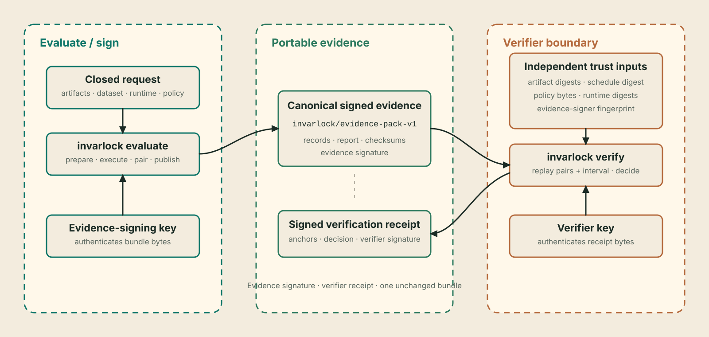

<div class="invarlock-hero" markdown>


<p class="invarlock-hero__kicker">Paired release-regression assurance</p>

# Evaluate once. Verify independently. Report clearly

<p class="invarlock-hero__lead">
InvarLock runs a pinned baseline and subject over one deterministic paired
schedule, applies an explicit interval-based regression policy, publishes
signed evidence, and lets another party replay the decision against
independently supplied trust anchors.
</p>

</div>

[Run a paired comparison](user-guide/getting-started.md) ·
[Read the assurance case](assurance/assurance-case.md)

```bash
invarlock evaluate request.yaml
invarlock verify evidence/
invarlock report evidence/
```


## The primary path

Run mode is the normal release-regression path:

1. Pin local baseline and subject artifacts, a local JSONL source, provider
   settings, one built-in metric or scorer binding, one policy, and a fresh
   output path in `request.yaml`.
2. Invoke `invarlock evaluate` from the host with digest-addressed baseline and
   subject runtime images, Docker or Podman, CPU/CUDA selections, and an
   evidence-signing key held by the host.
3. The host authenticates the JSONL bytes, prepares the ordered schedule, and
   launches one constrained worker per side. Each worker sees only its artifact
   and support resources read-only plus an isolated writable output directory.
   The host validates both outputs, derives built-in scores or replays the
   authorized scorer, derives the paired interval, publishes one bundle, and
   signs it without exposing the private key to either worker.
4. A verifier supplies its own policy copy, expected artifact identities,
   canonical schedule digest, runtime digests, evidence signer, identity, and
   signing key. `verify` replays the pack and writes a separately signed receipt.
5. `report` renders the signature-authenticated comparison as console text and,
   optionally, standalone HTML.

Shared image, device, and entrypoint options act as defaults when both sides use
the same runtime. Workers sharing a generic or identical CUDA device run
sequentially; explicitly different CUDA indexes can run in parallel. The host
owns the no-clobber evidence destination and evidence-signing key.

Import mode is the secondary path for complete provider sidecars created by
another controlled execution. It publishes the same bundle format and faces
the same verifier. Its inputs must include authenticated record-level material;
aggregate scores alone are insufficient.

## The three transactions

<div class="invarlock-transaction" markdown>

<div class="invarlock-transaction__step" markdown>

<span class="invarlock-transaction__number">Transaction 01</span>

### `evaluate`

Validate one closed baseline-versus-subject request. In run mode, prepare the
canonical schedule from digest-pinned local JSONL and execute the selected
providers in the delegated OCI environment. In import mode, authenticate
complete provider materials. Pair records by schedule identity, compute the
selected built-in metric or replay the authorized scorer, derive its paired
interval, apply the policy to the
conservative interval bound, and atomically publish signed evidence.

</div>

<div class="invarlock-transaction__step" markdown>

<span class="invarlock-transaction__number">Transaction 02</span>

### `verify`

Treat the bundle as untrusted. Verify inventory, checksums, signatures,
cross-bindings, schedule order, record-level scores, interval arithmetic, and
the canonical report. Compare the artifact identities, schedule, policy,
runtime identities, and evidence signer with caller-owned anchors, then record
the result in a separately signed receipt.

</div>

<div class="invarlock-transaction__step" markdown>

<span class="invarlock-transaction__number">Transaction 03</span>

### `report`

Authenticate the bundle's embedded evidence signature and integrity, then
render its canonical report. The view includes the point comparison,
selected paired interval, threshold, and scoped verdict. Evidence
remains the source of truth and the signed verification receipt remains the
independent acceptance record.

</div>

</div>

## Metrics and verdicts

| Metric | What is compared | Passing rule |
| --- | --- | --- |
| `exact_match` | Difference between subject and baseline literal accuracy, with paired regression/improvement counts and exact McNemar probability | Paired Newcombe interval lower bound is at least `metrics.exact_match.delta_min_pp` |
| `normalized_nll_per_utf8_byte` | Ratio of arithmetic means of teacher-forced expected-continuation NLL per UTF-8 byte | Paired schedule-resampling interval upper bound is at most `metrics.normalized_nll_per_utf8_byte.ratio_max` |
| Authorized deterministic text scorer | Difference between subject and baseline arithmetic-mean `[0,1]` scores, in percentage points | Paired schedule-resampling interval lower bound is at least `metrics.scorer_extension.delta_min_pp` |

Exact match uses a paired Newcombe 95% effect-size interval. Normalized NLL
uses the deterministic `paired_percentile_bootstrap_sha256_v1` method with
2,048 replicates over the authenticated finite schedule. The selected policy
reads the conservative bound of the corresponding interval.

Normalized NLL measures expected-continuation likelihood under teacher forcing,
not general model quality. If tokenizer contracts and paired token counts are
comparable, the report also includes a verifier-derived token-weighted
perplexity ratio as interpretation only; it has no policy, interval, or verdict
authority.

A request selects exactly one built-in `metric` or one complete
`scorer_extension` binding. Extension scorers receive only authenticated
expected-output and output-text facts, run only when explicitly authorized, and
cannot redefine aggregation or direction. The core ships the contract, not a
catalog of F1, extraction, or VQA scorer packages. Network, external-model,
human, executable SQL/code, semantic-model, and judge scoring remain outside
acceptance; judges fit the authenticated-observation path.

## Choose a reading path

| Responsibility | Start here | Continue with |
| --- | --- | --- |
| Run a first comparison | [Getting started](user-guide/getting-started.md) | [Evaluation request](user-guide/evaluation-request.md) and [schedule and policy](user-guide/schedule-and-policy.md) |
| Run the tiny real-model example | [Hugging Face CPU example](https://github.com/invarlock/invarlock/tree/main/examples/run) | [Runtime providers](user-guide/runtime-providers.md) and [evidence and verification](user-guide/evidence-and-verification.md) |
| Review or accept evidence | [Evidence and verification](user-guide/evidence-and-verification.md) | [Acceptance checklist](assurance/acceptance-checklist.md) and [decision semantics](assurance/decision-semantics.md) |
| Automate a gate | [CI integration](user-guide/ci-integration.md) | [Key management](user-guide/key-management.md) and [CLI reference](reference/cli.md) |
| Integrate a runtime | [Runtime providers](user-guide/runtime-providers.md) | [Provider reference](reference/runtime-providers.md) and [contracts](reference/contracts.md) |
| Import existing provider evidence | [Evaluation request](user-guide/evaluation-request.md#import-mode) | [Evidence artifacts](reference/artifacts.md) and [reports and receipts](reference/reports.md) |
| Embed the engine | [Python API](reference/api-guide.md) | [Architecture](reference/architecture.md) and [runtime-security API](reference/runtime-security.md) |
| Assess claims and risk | [Assurance case](assurance/assurance-case.md) | [Pairing and replay](assurance/pairing-and-replay.md), [trust model](security/trust-model.md), and [threat model](security/threat-model.md) |
| Maintain the project | [Documentation development](reference/documentation.md) | [Release verification](reference/release-verification.md) |

## What the evidence establishes

| Bound material | Why it is present | Verification consequence |
| --- | --- | --- |
| Baseline and subject identities | Name the exact artifacts being compared | Artifact substitution changes the authenticated comparison |
| Local JSONL identity and canonical schedule | Fix the source bytes, field mapping, selected ordered records, inputs, and targets | Changed source bytes, mapping, order, or schedule fail closed |
| Provider observations | Preserve record-level outputs or log-likelihood facts and runtime bindings | The verifier independently re-derives every paired score |
| Policy digest and content | Record the threshold applied at evaluation time | Verification requires the caller-supplied policy to match exactly |
| Point comparison and paired interval | Show the estimate and deterministic finite-schedule resampling bounds | The conservative interval bound, not the point value alone, controls the verdict |
| Runtime identities | Bind each side to a declared OCI execution environment | The verifier compares them with independent expected identities |
| Checksums and evidence signature | Authenticate the fixed bundle inventory and bytes | Integrity or signer mismatch rejects the bundle |

These bindings support a precise claim: an authorized evidence signer signed a
complete comparison for named inputs, and a named verifier accepted or rejected
that evidence under explicit anchors. Runtime digests identify declared bytes;
execution attestation requires separate evidence. The schedule fixes the
evaluated sample; population representativeness, safety, and broad quality
remain separate assessments.



## Runtime and integration choices

| Path | Package | Metrics | Intended use |
| --- | --- | --- | --- |
| Hugging Face Transformers | `invarlock[hf]` | Exact match and byte-normalized expected-continuation NLL | Built-in reference provider for local PyTorch/SafeTensors snapshots |
| GGUF / llama.cpp | `invarlock-runtime-gguf` | Exact match | Optional first-party provider for authenticated GGUF artifacts |
| TensorRT-LLM | `invarlock-runtime-tensorrt-llm` | Exact match | Optional first-party provider for authenticated engine bundles |
| Hugging Face vision-text | `invarlock-runtime-hf-vision-text` | Exact match | Optional first-party provider for authenticated prompt-and-image schedules |
| Imported provider material | Core plus the provider package needed to validate identities | Provider-declared metric | Secondary/offline integration when complete sidecars already exist |
| Custom runtime | Provider package | Declared by provider | ABI integration; strict evidence still requires explicit authorization |

Optional spectral, random-matrix, and variance diagnostics live in
`invarlock-diagnostics`. They remain observation-only; the paired metric and
policy exclusively determine the verdict. Authenticated attachments appear in
the report's separate authenticated-observations section.

## How the documentation is organized

| Type | Reader question | What the page provides | Start here |
| --- | --- | --- | --- |
| User guide | How do I complete this task safely? | Outcome, prerequisites, procedure, validation, and recovery | [Getting started](user-guide/getting-started.md) |
| Assurance note | Why is this scoped decision justified, and what could defeat it? | Plain-language interpretation, evidence, assumptions, arithmetic, and limits | [Assurance case](assurance/assurance-case.md) |
| Reference | What exactly does this interface accept, produce, or guarantee? | Current syntax, fields, outputs, and failure behavior | [CLI reference](reference/cli.md) |
| Security guidance | What must be protected and what risk remains? | Plain-language boundaries, adversaries, controls, and residual risk | [Trust model](security/trust-model.md) |

User guides explain complete tasks. Assurance pages state claims and replay
semantics. Reference pages define exact interfaces. Security pages describe
assets, threats, controls, and residual risk.

InvarLock is pre-1.0. Canonical artifact formats carry explicit versions;
non-contract embedding APIs may evolve between minor releases.
