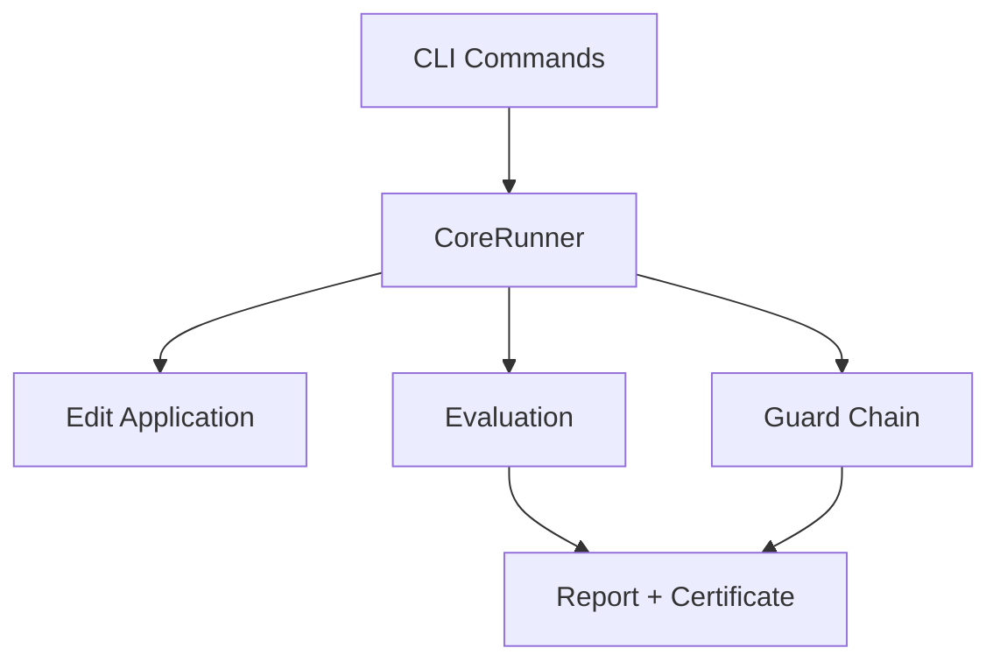
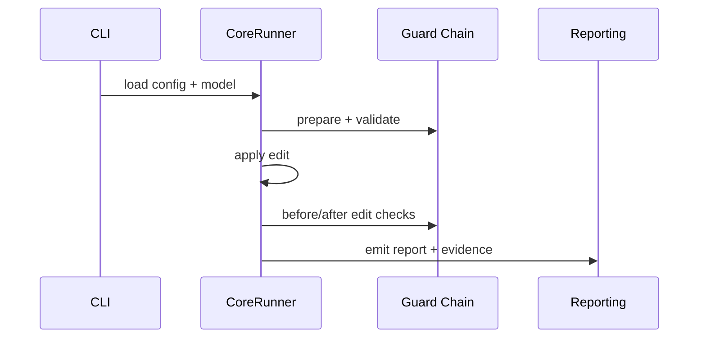
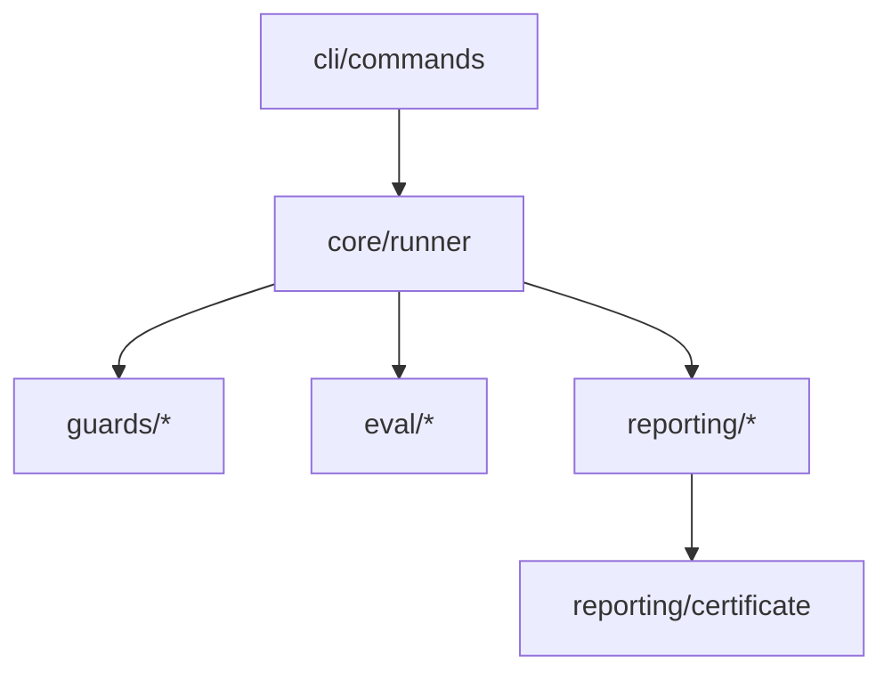

# InvarLock Architecture

## Overview

InvarLock is an edit-agnostic safety certification framework for ML model weight edits.

## System Architecture

### High-Level Flow

```text
CLI -> Core Runtime -> Guards -> Reporting
```

### Component Layers

1. **CLI Layer** (Typer-based)
   - `certify`, `run`, `verify`, `doctor`, `calibrate`, `report`, `export html`, `plugins`, `explain gates`
2. **Core Runtime** (`runner.py`)
   - Pipeline orchestration: prepare -> edit -> guards -> eval -> finalize
3. **Guards Layer**
   - Four-guard pipeline: invariants -> spectral -> RMT -> variance
4. **Reporting Layer**
   - Certificate generation, validation, rendering

## Key Design Decisions

1. Torch-independent core - `runner.py` coordinates without direct torch imports
2. Edit-agnostic design - guards work with any weight modification
3. Tier-based policies - calibrated thresholds in `tiers.yaml`
4. Deterministic evaluation - seed bundle + pairing schedules
5. Plugin architecture - entry points for guards, adapters, edits

## Data Flow






## Module Dependencies


