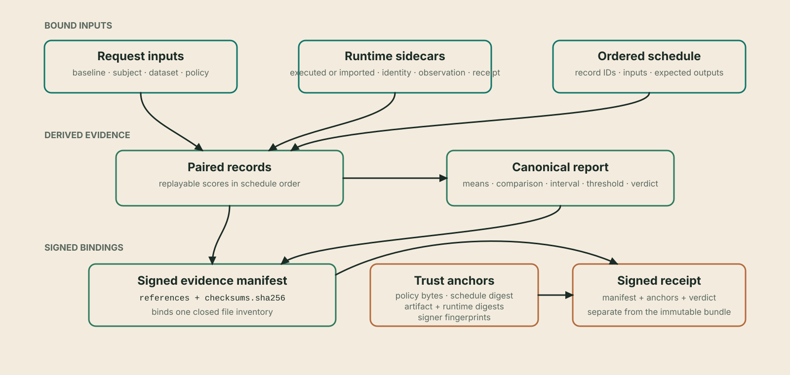

# Evidence artifacts

An `invarlock/evidence-pack-v1` bundle is a closed, signed evidence directory. Its paths
are fixed by the manifest schema; additional files are rejected in strict
verification.

!!! info "Reference"

    - **Surface:** `invarlock/evidence-pack-v1` directory, manifest, payload inventory, and external outputs
    - **Stability:** Versioned public artifact contract; fixed paths and closed inventory are verification requirements
    - **Use this page when:** Inspecting a bundle, implementing artifact storage, or determining which bytes carry a particular claim



## Directory layout

```text
evidence/
├── manifest.json
├── manifest.signature.json
├── checksums.sha256
├── request.json
├── inputs/
│   ├── baseline.json
│   ├── subject.json
│   ├── dataset.json
│   ├── baseline_runtime.json
│   ├── subject_runtime.json
│   └── policy.json
├── schedule/
│   └── runtime-behavioral-schedule.json
├── records/
│   └── paired-records.json
├── reports/
│   └── evaluation.report.json
├── runs/
│   ├── baseline/report.json
│   └── subject/report.json
└── providers/
    ├── baseline/
    │   ├── run.yaml
    │   ├── runtime.manifest.json
    │   ├── model-artifact.identity.json
    │   ├── runtime-provider.receipt.json
    │   └── runtime-scoring.observation.json
    └── subject/
        └── ...the same five files...
```

`inputs/*.json` are identity records, not copies of model weights, the dataset,
or the policy. Each carries a material digest and may carry a stable locator or
media type. The exact normalized request, schedule, provider material, paired
records, and canonical report are separate payloads referenced by the manifest.

| Path or group | Cardinality | Authority in replay |
| --- | --- | --- |
| `request.json` | One | Normalized evaluation intent; never substitutes for independent verifier anchors |
| `inputs/*.json` | Six | Role-specific identity records and material digests |
| `schedule/*.json` | One | Ordered dataset records and expected outputs |
| `providers/{side}/*` | Five per side | Artifact, observation, provider, configuration, and runtime provenance |
| `runs/{side}/report.json` | One per side | Minimal side-to-observation binding |
| `records/paired-records.json` | One | Verifier-reproducible record scores; not an accepted aggregate |
| `reports/evaluation.report.json` | One | Canonical means, comparison, paired interval, threshold, optional sample qualification, and verdict reproduced by verification |
| `observations/*.json` | Zero to 64 | Authenticated typed context; descriptive only and excluded from policy replay |
| `checksums.sha256` | One | Exact payload-byte inventory |
| `manifest.json` and signature | One each | Closed references and signer authentication |

## Manifest

`manifest.json` contains exactly:

- `format` and deterministic `comparison_id`;
- six input references: baseline, subject, dataset, both runtimes, and policy;
- fifteen evidence-role references at their fixed paths;
- the paired-record path, digest, and count;
- optional typed observation references with fixed paths, digests, kinds, and scopes;
- the checksum-file path and digest; and
- the evidence-signing key fingerprint.

Every input reference has a digest of the identity file and a distinct
`material_digest` for the authenticated input. Every evidence reference has a
digest of the exact file bytes.

The manifest structure is equivalent to this abbreviated, non-copyable view:

```text
{
  "format": "invarlock/evidence-pack-v1",
  "comparison_id": "...",
  "inputs": {
    "baseline": {
      "path": "inputs/baseline.json",
      "digest": "sha256:...",
      "material_digest": "sha256:..."
    },
    "subject": { ... },
    "dataset": { ... },
    "baseline_runtime": { ... },
    "subject_runtime": { ... },
    "policy": { ... }
  },
  "evidence": {
    "request": {"path": "request.json", "digest": "sha256:..."},
    "schedule": {"path": "schedule/runtime-behavioral-schedule.json", "digest": "sha256:..."},
    "evaluation_report": {"path": "reports/evaluation.report.json", "digest": "sha256:..."},
    "...": "twelve additional fixed evidence roles"
  },
  "paired_records": {
    "path": "records/paired-records.json",
    "digest": "sha256:...",
    "count": 20
  },
  "checksums_sha256": "checksums.sha256",
  "checksums_sha256_digest": "...bare sha256...",
  "signing_key_fingerprint": "sha256:..."
}
```

The real object has no comments, ellipses, or abbreviated roles. It has exactly
six input references and fifteen evidence references at schema-fixed paths.

`manifest.signature.json` embeds the Ed25519 public key, its fingerprint, and a
base64 signature over the exact canonical `manifest.json` bytes. The public key
is evidence of who signed only after its fingerprint is matched to an
independent expected signer.

| Signature field | Meaning |
| --- | --- |
| `format` | `invarlock/evidence-pack-signature-v1` |
| `algorithm` | Ed25519 |
| Embedded public key | Verification material, not an independent trust anchor |
| Public-key fingerprint | SHA-256 of the raw Ed25519 public key |
| Signature | Authentication of the exact canonical manifest bytes |

## Checksums and closed inventory

`checksums.sha256` covers every payload below the manifest, but not the manifest
or its signature. The manifest separately binds the checksum file. Verification
checks both directions:

- every manifest payload must be covered; and
- no checksum or directory entry may introduce an undeclared payload.

Regular-file, no-symbolic-link, size, and safe-relative-path rules apply while
reading. A valid checksum does not make a file semantically valid; cross-file
replay follows the integrity checks.

The manifest is outside the checksum payload because it binds the checksum
file. The signature is outside both because it authenticates the canonical
manifest. This avoids a self-referential digest while still closing every pack
byte into one directed dependency graph.

## Paired records

`records/paired-records.json` has exactly:

```json
{
  "format": "invarlock/paired-records-v1",
  "metric": "exact_match",
  "schedule_sha256": "...",
  "records": [
    {
      "record_id": "example-1",
      "input_sha256": "...",
      "baseline": {
        "observation_record_digest": "sha256:...",
        "score": 1.0
      },
      "subject": {
        "observation_record_digest": "sha256:...",
        "score": 1.0
      }
    }
  ]
}
```

The engine derives this file from the canonical schedule and both scoring
observations. It rejects failed observation records, order changes, input-digest
mismatches, output-text/digest mismatches, and schedules without expected
outputs. Import mode must supply byte-canonical paired records equal to that
fresh derivation; imported scores are never accepted as authority.

For `exact_match`, each score is `1.0` when output text exactly equals expected
output and `0.0` otherwise. For `normalized_nll_per_utf8_byte`, each score is
`-logprob_sum / utf8_byte_count`; required counts must be positive and the result
finite and non-negative.

When a scorer extension is selected, the paired-record object also binds the
exact scorer configuration and each side's replay result. The explicitly
authorized scorer receives only authenticated `expected_output`, `output_text`,
and `output_sha256` facts and returns one higher-is-better value in `[0, 1]`
per record. The core verifies result order and digests, computes the arithmetic
mean and paired percentage-point delta, and owns the interval and verdict.

Normalized NLL is teacher-forced expected-continuation likelihood regression,
not a general model-quality measure. The paired-record object may also carry a
verifier-derived perplexity interpretation when the authenticated tokenizer
contracts and every pair's positive target-token counts match. That object has
no policy, interval, or verdict authority; an unavailable interpretation does
not invalidate the byte-normalized NLL comparison.

The canonical report adds the metric-specific paired interval to the two side
means and point comparison. New reports use
`invarlock/comparison-report-v3`; the verifier also replays existing v2 and
`invarlock/comparison-report-v1` packs under their original semantics. Exact
match records paired regression and improvement counts, an exact two-sided
McNemar probability, and the paired Newcombe 95% effect-size interval whose
lower bound controls policy. Normalized NLL uses the upper bound of its
authenticated-schedule resampling interval. An authorized scorer extension
uses the lower bound of the same fixed paired-resampling method against
`metrics.scorer_extension.delta_min_pp`.

When the policy supplies the coupled sample controls, the v2 report also
contains `sample_qualification`. It records the minimum and observed paired
count, maximum and observed interval width, units, each check's result, and the
combined result. The final verdict is the conjunction of that result and the
metric-bound result.

## Provider sidecars

Each comparison side includes:

| File | Binding |
| --- | --- |
| `model-artifact.identity.json` | Portable authenticated identity for the actual model artifact |
| `runtime-scoring.observation.json` | Ordered backend facts bound to provider, artifact, and schedule |
| `runtime-provider.receipt.json` | Plugin/backend/capability/artifact/settings/device/image provenance bound to the observation |
| `report.json` | Minimal side report binding provider, artifact, observation, schedule, and count |
| `run.yaml` | Canonical side configuration copied as exact evaluation-emitted bytes |
| `runtime.manifest.json` | Report/config/sidecar digests and strict per-side worker-container facts |

The evidence transaction copies these exact bytes. It does not regenerate
sidecars in a way that could break their original runtime-manifest bindings.

## Publication and immutability

Evaluation writes a staging directory, flushes files to disk, signs the manifest, and
atomically renames the directory into place. It never replaces an existing
destination. Published files are read-only and directories are non-writable.

Filesystem permissions are a local hardening measure, not the integrity model.
Any later byte change, missing file, or extra file is detected by strict
verification. Verification receipts and rendered HTML must remain outside the
bundle so the bundle can stay byte-identical.

## External outputs

| Output | Produced by | May be written inside pack? | Trust meaning |
| --- | --- | --- | --- |
| Signed verification receipt | `invarlock verify` | No | Independent verifier assertion over manifest, anchors, and verdict |
| Console report | `invarlock report` | Not a file | Human rendering of signature-authenticated canonical content |
| Self-contained HTML | `invarlock report --html` | No | Unsigned presentation; not independent acceptance |

Multiple verifiers can issue separate receipts for the same immutable manifest.
They can use distinct verifier identities and keys. Each must independently
supply the expected artifact, schedule, policy, runtime, and evidence-signer
anchors. The policy bytes must match the policy material already bound by the
pack; a different policy requires a newly evaluated evidence bundle.

## Related documentation

- [Public contracts](contracts.md) defines the manifest schema, canonical JSON,
  and digest rules.
- [Reports and receipts](reports.md) defines the report and external receipt
  carried by or associated with a bundle.
- [Evaluation lifecycle](lifecycle.md) explains atomic publication and failure
  boundaries.
- [Architecture](architecture.md) places the artifact inventory within the
  evidence-signer-verifier trust model.
