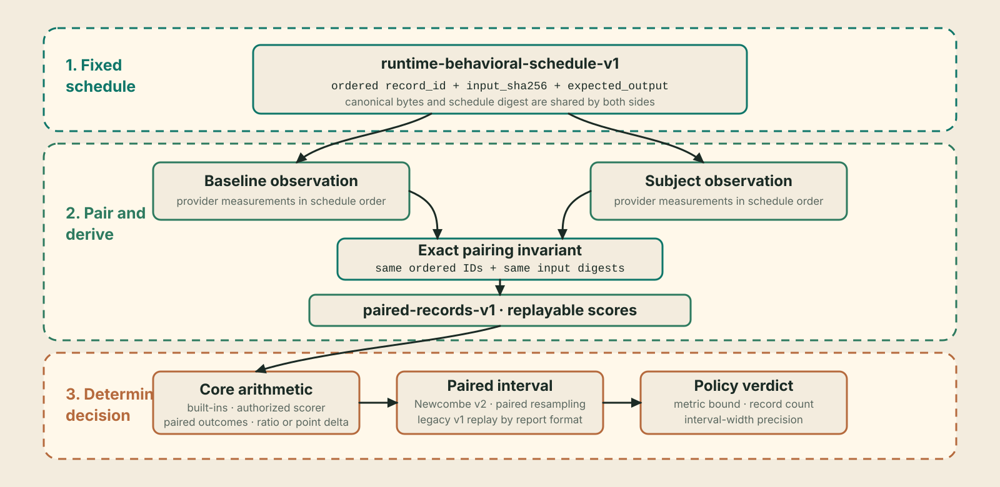

# Schedule and policy

The evaluation source defines which ordered records both sides score. The
metric defines the paired comparison. The policy defines the conservative
interval bound that must clear its threshold. Their exact identities are bound
into the evidence.

Treat them as one decision specification:

- the pinned JSONL bytes and mapping determine the finite schedule;
- the built-in metric or bound scorer determines each record score;
- the selected comparison's paired interval describes uncertainty or schedule
  sensitivity; and
- the policy determines where the interval passes or fails.

InvarLock authenticates, executes, and replays this specification. It does not
choose a representative sample or a suitable threshold for you.



!!! tip "User guide"

    **Outcome:** Freeze a digest-pinned local JSONL source and one closed
    comparison policy before collecting subject results.

    **Audience:** Evaluation owners, dataset curators, policy authors, and
    independent decision owners.

    **Prerequisites:** A concrete release-regression claim, fixed source
    material, stable record identities, a supported built-in metric or
    authorized scorer binding, and an independent policy-distribution path.

## Design the decision first

1. State the concrete release-regression claim in one sentence.
2. Identify the operational context to which that sentence applies.
3. Select prompts and expected outputs without inspecting subject outcomes.
4. Choose `exact_match` for literal closed answers or
   `normalized_nll_per_utf8_byte` for teacher-forced expected-continuation
   likelihood regression, or bind an explicitly authorized deterministic text
   scorer for a task-specific unit-interval result.
5. Select the threshold, unit, conservative interval bound, and failure action.
6. Freeze the JSONL bytes, field mapping, optional exact prefix, and SHA-256.
7. Freeze the policy bytes and distribute an independent copy to verifiers.

A reviewable claim is:

> Compare the fixed subject with the fixed baseline on these 400 ordered
> release prompts. Reject when the lower bound of the paired exact-match delta
> interval is below minus two percentage points. Any artifact, source,
> expected-output, decoding, metric, resampling, or threshold change creates a
> new transaction.

That is narrower and more reproducible than “the new model is as good as the
old model.”

## Primary input: pinned local JSONL

Run requests identify source bytes and field mapping directly:

```yaml
dataset:
  path: inputs/release-regression.jsonl
  sha256: 4444444444444444444444444444444444444444444444444444444444444444
  format: jsonl
  name: release-regression
  split: validation
  input_field: prompt
  expected_output_field: expected
  id_field: case_id
  limit: 400
```

Each selected line is one JSON object:

```json
{"case_id":"release/001","prompt":"Return A","expected":"A"}
{"case_id":"release/002","prompt":"Return B","expected":"B"}
```

InvarLock verifies the source SHA-256 before parsing, preserves line order,
selects exactly the declared prefix, maps the named top-level text fields, and
builds canonical schedule bytes. The source limit cannot silently shrink: a
file with fewer selected lines fails.

If `id_field` is absent, deterministic position IDs are generated as
`record/00000000`, `record/00000001`, and so on. Prefer durable source IDs when
they exist; they make a failed record identifiable outside one array position.

The source may contain additional metadata fields, but only the declared ID,
input, and expected-output fields enter the schedule. Preserve any separate
provenance, licenses, or adjudication records needed to justify the selection.

## Canonical prepared schedule

The prepared contract is
[`invarlock/runtime-behavioral-schedule-v1`](https://github.com/invarlock/invarlock/blob/main/contracts/runtime_behavioral_schedule.schema.json).
It contains dataset identity and ordered records:

```json
{
  "dataset_identity": {
    "config_name": "evaluation-records-jsonl-v1",
    "dataset_name": "release-regression",
    "provider": "local",
    "revision": "4444444444444444444444444444444444444444444444444444444444444444",
    "split": "validation"
  },
  "format_version": "invarlock/runtime-behavioral-schedule-v1",
  "records": [
    {
      "expected_output": "A",
      "input_parts": [
        {
          "kind": "text",
          "role": "prompt",
          "sha256": "577b00dc694a427d676d63076c8bb19ff06800e09242cf3f078c3c8580c1c367",
          "text": "Return A"
        }
      ],
      "input_sha256": "99997ee448561eff2f1ca7635038e8ca56ec584c1a968b8ca8803bee4551538b",
      "record_id": "release/001"
    }
  ],
  "task": "text_causal"
}
```

Canonical schedule JSON uses UTF-8, recursively sorted keys, compact separators,
finite numbers, and no trailing newline. Run mode prepares it inside the
transaction. Import mode instead requires the canonical file at both
`comparison.dataset` and `execution.schedule`.

InvarLock recomputes:

```text
text_part.sha256 = SHA-256(UTF-8(text_part.text))
input_sha256 = SHA-256(canonical JSON of ordered input_parts)
schedule_sha256 = SHA-256(canonical schedule bytes)
```

The normalized request preserves the source digest and field mapping. The
prepared schedule binds the resulting dataset identity, order, inputs, targets,
IDs, and selection. Both are included in the signed evidence transaction.

Closed limits include:

| Boundary | Limit |
| --- | ---: |
| Local JSONL source or canonical schedule | 16 MiB |
| Selected records | 1 to 10,000 |
| `record_id` | 256 characters |
| Text in one input part | 65,536 characters |
| Input parts per record | 64 |
| `expected_output` | 65,536 characters |
| Dataset name | 512 characters |
| Split | 128 characters |

Record order is semantic. Baseline and subject observations must contain the
same IDs in exactly schedule order and repeat each corresponding input digest.
Pairing by position under different IDs, dropping errors, or sorting after
execution is rejected.

## Curate the finite schedule

Review each selected record:

| Field | Review question |
| --- | --- |
| ID | Is it stable, unique, and meaningful outside array position? |
| Input | Is this the exact prompt and template both sides should receive? |
| Expected output | Is literal equality or teacher-forced scoring appropriate? |
| Source identity | Can the decision owner explain where the bytes came from? |
| Category metadata | Is coverage of the intended release behavior documented outside the schedule? |

For larger schedules, check:

- duplicates and near-duplicates;
- train/test or benchmark contamination;
- empty, malformed, or trivially predictable records;
- representation across behavior categories in scope;
- expected-output provenance and adjudication;
- prompt templates and hidden prefixes; and
- repeated tuning exposure to the subject developer.

These are governance and sampling controls outside the schema. A valid but
biased schedule remains biased.

## Metric-specific paired intervals

Exact match uses a paired Newcombe hybrid-score 95% interval over the
subject-minus-baseline binary effect. The report also records baseline-pass to
subject-fail regressions, baseline-fail to subject-pass improvements, both-pass
and both-fail counts, and the exact two-sided McNemar probability. The policy
uses the Newcombe interval's lower bound; the McNemar probability is supporting
paired evidence rather than an acceptance control.

Normalized NLL uses the following deterministic schedule-resampling object:

```json
{
  "method": "paired_percentile_bootstrap_sha256_v1",
  "scope": "authenticated_schedule",
  "interval_mass": 0.95,
  "replicates": 2048,
  "lower": 0.0,
  "upper": 2.5
}
```

For each replicate and draw, InvarLock derives an index from SHA-256 of the
authenticated schedule digest, replicate number, and draw number. It resamples
schedule positions with replacement and recomputes the complete paired
comparison. Percentile endpoints are the linearly interpolated 2.5th and 97.5th
percentiles across 2,048 values. A one-record schedule produces a point
interval.

The algorithm never separates one baseline score from its paired subject score.
Its result is deterministic across verifier replay and does not depend on a
platform pseudo-random-number generator.

The normalized-NLL interval measures stability under paired resampling of this finite
authenticated schedule. Because the selected records are not asserted to be an
independent random sample from a defined population, the interval is not a
population confidence interval. It does not establish representativeness,
statistical power, equivalence, non-inferiority, or production safety.

## Exact-match policy

```json
{"resolved_policy":{"metrics":{"exact_match":{"delta_min_pp":-2.0}}}}
```

For baseline accuracy `B` and subject accuracy `S`:

```text
point_delta_pp = 100 * (S - B)
pass when interval.lower >= delta_min_pp
```

A value of `-2.0` requires even the paired interval's lower bound to remain at
or above a two-percentage-point drop. The point delta may be above the floor
while the verdict still fails because its interval crosses the floor.

The paired-binary section distinguishes regressions (baseline pass, subject
fail) from improvements (baseline fail, subject pass). It reports their exact
two-sided McNemar probability and the Newcombe 95% interval for the effect size.
Only the interval lower bound controls this policy.

| Point delta | Interval | Minimum | Result |
| ---: | ---: | ---: | --- |
| `+1 pp` | `[-1, +3]` | `-2 pp` | pass |
| `0 pp` | `[-2, +2]` | `-2 pp` | pass at boundary |
| `0 pp` | `[-3, +3]` | `-2 pp` | fail |

## Normalized-NLL policy

```json
{"resolved_policy":{"metrics":{"normalized_nll_per_utf8_byte":{"ratio_max":1.05}}}}
```

For each record and side:

```text
record_nll = -logprob_sum / utf8_byte_count
point_ratio = arithmetic_mean(subject_record_nll) / arithmetic_mean(baseline_record_nll)
pass when interval.upper <= ratio_max
```

The baseline arithmetic mean must be positive. Each scheduled record has equal
aggregate weight regardless of target length. This is not pooled NLL, a
byte-weighted mean, or perplexity.

This metric is teacher-forced expected-continuation likelihood regression under
the authenticated prompt, target, provider, and runtime. It is not a measure of
general model quality, instruction following, factuality, or user preference.

| Point ratio | Interval | Maximum | Result |
| ---: | ---: | ---: | --- |
| `0.98` | `[0.96, 1.02]` | `1.05` | pass |
| `1.01` | `[0.98, 1.05]` | `1.05` | pass at boundary |
| `1.01` | `[0.98, 1.08]` | `1.05` | fail |

## Deterministic scorer-extension policy

An extension scorer policy pins the complete algorithm identity selected by the
request:

```json
{
  "resolved_policy": {
    "metrics": {
      "scorer_extension": {
        "scorer_id": "example.token_f1",
        "scorer_version": "1.0.0",
        "descriptor_sha256": "5555555555555555555555555555555555555555555555555555555555555555",
        "configuration_sha256": "6666666666666666666666666666666666666666666666666666666666666666",
        "delta_min_pp": -2.0
      }
    }
  }
}
```

The request binding and policy pins must match exactly. The authorized scorer
maps each authenticated expected-output/output-text pair to one deterministic
higher-is-better value in `[0,1]`. Core owns the remaining arithmetic:

```text
baseline_mean = arithmetic_mean(baseline_record_scores)
subject_mean = arithmetic_mean(subject_record_scores)
delta_pp = 100 * (subject_mean - baseline_mean)
pass when interval.lower >= delta_min_pp
```

The interval is the same deterministic 2,048-replicate paired
schedule-resampling method used for normalized NLL, but it recomputes the
percentage-point delta and uses its lower bound. Extension code cannot redefine
aggregation, direction, interval, or verdict semantics.

Potential implementations include deterministic token F1, structured-field
extraction, and VQA answer normalization. No such package ships with InvarLock.
Executable SQL/code tests, model-based semantic similarity, network or human
scoring, external-model calls, and LLM judges require separate authenticated
contracts. Judge results remain observations.

## Derived perplexity interpretation

For normalized NLL, the verifier also renders a token-weighted perplexity ratio
when both artifacts bind the same authenticated tokenizer and every pair has
the same positive target-token count. It is derived from authenticated target
log probabilities and records both side perplexities, their ratio, the
tokenizer digest, and total target-token count.

This derived measurement is an interpretation of the likelihood facts. It has
no policy threshold, interval, or verdict authority. If the tokenizer or token
counts are not comparable, the report records why the interpretation is
unavailable while the byte-normalized NLL decision remains well-defined.

## Policy provenance and handoff

Policy JSON contains exactly one entry matching the request's built-in metric
or `scorer_extension` binding. Keep it
small, reviewed, and immutable. Evaluation binds the exact policy bytes into
the evidence. Verification reads an independently distributed copy and
requires the same digest.

```text
policy review
    |
    +--> approved bytes --> evaluation request
    |
    +--> independent copy --> verifier input
```

Whitespace changes create different bytes even when parsed values are
equivalent. Distribute the approved file rather than recreating it. Record:

- policy digest and activation boundary;
- built-in metric or scorer identity, threshold, interval-bound rule, and
  rationale;
- source digest, mapping, limit, and resulting schedule digest;
- review or change-control record where applicable; and
- action on boundary pass, policy rejection, or integrity failure.

Threshold selection remains an external decision. InvarLock proves which bytes
and rule were applied; it cannot prove that the chosen threshold or selected
schedule is scientifically or operationally sufficient.

## Preflight checklist

- [ ] JSONL bytes are frozen and their SHA-256 matches the request.
- [ ] Field mapping is correct; selected IDs are stable and unique.
- [ ] Source order, prefix limit, prompts, and expected outputs were approved
      before subject results were inspected.
- [ ] Both providers support the selected task and built-in or collection
      metric.
- [ ] An extension scorer, if selected, is explicitly authorized and its
      request and policy identity pins match.
- [ ] For normalized NLL, expected continuations are suitable for
      teacher-forced likelihood comparison and its limits are understood.
- [ ] Any displayed perplexity ratio is treated as a derived interpretation,
      not as a policy result.
- [ ] The policy contains only the matching metric block and correct threshold
      unit.
- [ ] Everyone using the result understands which interval bound controls the
      verdict.
- [ ] The verifier has an independently distributed, byte-identical policy.
- [ ] Representativeness, contamination, repeated-tuning, and operational
      limitations are recorded outside the bundle.

Continue with [Decision semantics](../assurance/decision-semantics.md) for the
exact arithmetic and [Pairing and replay](../assurance/pairing-and-replay.md)
for record-level enforcement.
